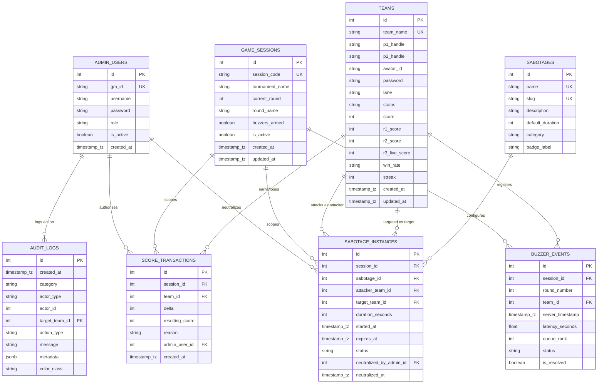

# PostgreSQL Database Architecture & Schema Specification
**Platform**: Code with Comali (CWC 2026) Competition Platform  
**Engine**: PostgreSQL 16+  
**ORM**: SQLAlchemy 2.0 (Async)  
**Migration Tool**: Alembic  
**Authority**: Authoritative Production Database  

---

## 1. System Overview & Core Principles

1. **PostgreSQL Authoritative Engine**: PostgreSQL is the single source of truth for all tournament states, teams, buzzer order, score transactions, sabotages, and audit logs.
2. **Server-Authoritative Competition Logic**: All competition-critical actions (buzzer registration, scoring, floor arbitrage, sabotage deployment, and neutralization) are calculated and validated on the backend. Client timestamps are logged for reference, but queue rankings and timers are strictly determined by PostgreSQL server timestamps and database row-level locking.
3. **Immutable Audit Ledger (*Kanaku Valaku*)**: Every score mutation, buzzer press, sabotage trigger, and admin override is committed to an immutable transaction ledger (`score_transactions`, `audit_logs`).
4. **Zero Silent Changes**: All database changes are governed strictly by SQLAlchemy models and tracked via timestamped Alembic migration revisions.
5. **No Password Encryption**: As requested for this competition platform, player squad access keys and game master master keys are stored directly without encryption.

---

## 2. Entity-Relationship Diagram



---

## 3. Detailed Table Specifications

### 3.1 `teams`
* **Purpose**: Primary identity and standings registry for all competing 2-player squads.
* **Columns**:
  | Column | Data Type | Nullable | Default | Description |
  | :--- | :--- | :--- | :--- | :--- |
  | `id` | `INTEGER` | `NOT NULL` | Autoincrement | Primary Key |
  | `team_name` | `VARCHAR(100)` | `NOT NULL` | - | Official dual-squad name (Unique) |
  | `p1_handle` | `VARCHAR(100)` | `NOT NULL` | - | Squad Member 01 handle / name |
  | `p2_handle` | `VARCHAR(100)` | `NOT NULL` | - | Squad Member 02 handle / name |
  | `avatar_id` | `VARCHAR(50)` | `NOT NULL` | `'avatar-1'` | Chosen profile picture avatar ID |
  | `password` | `VARCHAR(255)` | `NOT NULL` | - | Squad access password (plain text) |
  | `lane` | `VARCHAR(50)` | `NOT NULL` | `'Lane #01'` | Physical / virtual competition lane |
  | `status` | `VARCHAR(30)` | `NOT NULL` | `'CONNECTED'` | Connection status (`CONNECTED`, `DISCONNECTED`, `STANDBY`) |
  | `score` | `INTEGER` | `NOT NULL` | `0` | Authoritative total tournament points |
  | `r1_score` | `INTEGER` | `NOT NULL` | `0` | Round 01 points tally |
  | `r2_score` | `INTEGER` | `NOT NULL` | `0` | Round 02 points tally |
  | `r3_live_score`| `INTEGER` | `NOT NULL` | `0` | Round 03 live points tally |
  | `win_rate` | `VARCHAR(20)` | `NOT NULL` | `'0%'` | Squad win rate metric |
  | `streak` | `INTEGER` | `NOT NULL` | `0` | Active winning / correct answer streak |
  | `created_at` | `TIMESTAMP WITH TIME ZONE` | `NOT NULL` | `CURRENT_TIMESTAMP` | Squad registration timestamp |
  | `updated_at` | `TIMESTAMP WITH TIME ZONE` | `NOT NULL` | `CURRENT_TIMESTAMP` | Last updated timestamp |
* **Constraints**:
  * Primary Key: `pk_teams` (`id`)
  * Unique: `uq_teams_team_name` (`team_name`)
  * Check: `chk_teams_status` (`status IN ('CONNECTED', 'DISCONNECTED', 'STANDBY')`)
* **Indexes**:
  * `ix_teams_team_name` (`team_name` UNIQUE)
  * `ix_teams_score` (`score` DESC) - Supports fast sub-millisecond leaderboard queries

---

### 3.2 `admin_users`
* **Purpose**: Credentials and profile registry for tournament Game Masters / Arbiters.
* **Columns**:
  | Column | Data Type | Nullable | Default | Description |
  | :--- | :--- | :--- | :--- | :--- |
  | `id` | `INTEGER` | `NOT NULL` | Autoincrement | Primary Key |
  | `gm_id` | `VARCHAR(50)` | `NOT NULL` | - | Game Master Identifier (Unique, e.g. `'GM_ARBITER_07'`) |
  | `username` | `VARCHAR(100)` | `NOT NULL` | - | Display name of the Game Master |
  | `password` | `VARCHAR(255)` | `NOT NULL` | - | Master security override password (plain text) |
  | `role` | `VARCHAR(50)` | `NOT NULL` | `'GAME_MASTER'` | Access role (`GAME_MASTER`, `ADMIN`) |
  | `is_active` | `BOOLEAN` | `NOT NULL` | `TRUE` | Account status flag |
  | `created_at` | `TIMESTAMP WITH TIME ZONE` | `NOT NULL` | `CURRENT_TIMESTAMP` | Account creation timestamp |
* **Constraints**:
  * Primary Key: `pk_admin_users` (`id`)
  * Unique: `uq_admin_users_gm_id` (`gm_id`)
* **Indexes**:
  * `ix_admin_users_gm_id` (`gm_id` UNIQUE)

---

### 3.3 `game_sessions`
* **Purpose**: Manages active tournament rounds, master buzzer circuits, and clock telemetry.
* **Columns**:
  | Column | Data Type | Nullable | Default | Description |
  | :--- | :--- | :--- | :--- | :--- |
  | `id` | `INTEGER` | `NOT NULL` | Autoincrement | Primary Key |
  | `session_code` | `VARCHAR(50)` | `NOT NULL` | - | Unique session code (e.g. `'STG-TOURNAMENT-2025-Q1'`) |
  | `tournament_name` | `VARCHAR(150)` | `NOT NULL` | `'Code with Comali 2026'` | Tournament event title |
  | `current_round` | `INTEGER` | `NOT NULL` | `1` | Active round index (1, 2, 3...) |
  | `round_name` | `VARCHAR(100)` | `NOT NULL` | `'Round 01 - Technical Architecture'` | Active challenge title |
  | `buzzers_armed` | `BOOLEAN` | `NOT NULL` | `TRUE` | Master hardware circuit status (`TRUE` = Armed, `FALSE` = Locked) |
  | `is_active` | `BOOLEAN` | `NOT NULL` | `TRUE` | Session active flag |
  | `created_at` | `TIMESTAMP WITH TIME ZONE` | `NOT NULL` | `CURRENT_TIMESTAMP` | Session start timestamp |
  | `updated_at` | `TIMESTAMP WITH TIME ZONE` | `NOT NULL` | `CURRENT_TIMESTAMP` | Session update timestamp |
* **Constraints**:
  * Primary Key: `pk_game_sessions` (`id`)
  * Unique: `uq_game_sessions_session_code` (`session_code`)
* **Indexes**:
  * `ix_game_sessions_session_code` (`session_code` UNIQUE)

---

### 3.4 `buzzer_events`
* **Purpose**: Records all buzzer activations with microsecond precision, establishing the sequential queue order for *Mani Adi* and *Thalaivar Page*.
* **Columns**:
  | Column | Data Type | Nullable | Default | Description |
  | :--- | :--- | :--- | :--- | :--- |
  | `id` | `INTEGER` | `NOT NULL` | Autoincrement | Primary Key |
  | `session_id` | `INTEGER` | `NOT NULL` | - | Foreign Key → `game_sessions.id` |
  | `round_number` | `INTEGER` | `NOT NULL` | - | Active tournament round index |
  | `team_id` | `INTEGER` | `NOT NULL` | - | Foreign Key → `teams.id` |
  | `server_timestamp`| `TIMESTAMP WITH TIME ZONE` | `NOT NULL` | - | Microsecond server reception timestamp |
  | `latency_seconds`| `DOUBLE PRECISION` | `NOT NULL` | - | Calculated reaction latency |
  | `queue_rank` | `INTEGER` | `NOT NULL` | - | Validated position in queue (#1, #2, #3, ...) |
  | `status` | `VARCHAR(30)` | `NOT NULL` | `'ACCEPTED'` | Triage status (`ACCEPTED`, `REJECTED_LOCKED`, `REJECTED_DUPLICATE`) |
  | `is_resolved` | `BOOLEAN` | `NOT NULL` | `FALSE` | Has the Game Master arbitrated this buzz |
* **Constraints**:
  * Primary Key: `pk_buzzer_events` (`id`)
  * Foreign Keys:
    * `fk_buzzer_events_session` (`session_id`) REFERENCES `game_sessions` (`id`) ON DELETE CASCADE
    * `fk_buzzer_events_team` (`team_id`) REFERENCES `teams` (`id`) ON DELETE CASCADE
  * Unique: `uq_buzzer_session_round_team` (`session_id`, `round_number`, `team_id`) - Prevents double-buzzing in the same round buffer
* **Indexes**:
  * `ix_buzzer_events_session_round` (`session_id`, `round_number`, `queue_rank`)
  * `ix_buzzer_events_server_timestamp` (`server_timestamp` ASC)

---

### 3.5 `sabotages`
* **Purpose**: Master catalog of tactical disruption payloads (*Power-up Pothys*).
* **Columns**:
  | Column | Data Type | Nullable | Default | Description |
  | :--- | :--- | :--- | :--- | :--- |
  | `id` | `INTEGER` | `NOT NULL` | Autoincrement | Primary Key |
  | `name` | `VARCHAR(100)` | `NOT NULL` | - | Display name (e.g. `'Static Blind'`, `'Sound Distortion'`) |
  | `slug` | `VARCHAR(50)` | `NOT NULL` | - | Programmatic identifier (e.g. `'static-blind'`) |
  | `description` | `TEXT` | `NOT NULL` | - | Tactical description of the sabotage |
  | `default_duration`| `INTEGER` | `NOT NULL` | - | Duration in seconds (15, 20, 10, 30...) |
  | `category` | `VARCHAR(50)` | `NOT NULL` | `'DISRUPTION'` | Tactical payload category |
  | `badge_label` | `VARCHAR(50)` | `NOT NULL` | `'Available'` | HUD badge label |
* **Constraints**:
  * Primary Key: `pk_sabotages` (`id`)
  * Unique: `uq_sabotages_name` (`name`), `uq_sabotages_slug` (`slug`)
* **Indexes**:
  * `ix_sabotages_slug` (`slug` UNIQUE)

---

### 3.6 `sabotage_instances`
* **Purpose**: Tracks live and historic sabotage deployments, countdowns, and administrative neutralizations.
* **Columns**:
  | Column | Data Type | Nullable | Default | Description |
  | :--- | :--- | :--- | :--- | :--- |
  | `id` | `INTEGER` | `NOT NULL` | Autoincrement | Primary Key |
  | `session_id` | `INTEGER` | `NOT NULL` | - | Foreign Key → `game_sessions.id` |
  | `sabotage_id` | `INTEGER` | `NOT NULL` | - | Foreign Key → `sabotages.id` |
  | `attacker_team_id`| `INTEGER` | `NOT NULL` | - | Foreign Key → `teams.id` (Deploying squad) |
  | `target_team_id` | `INTEGER` | `NOT NULL` | - | Foreign Key → `teams.id` (Impacted squad) |
  | `duration_seconds`| `INTEGER` | `NOT NULL` | - | Active duration window |
  | `started_at` | `TIMESTAMP WITH TIME ZONE` | `NOT NULL` | `CURRENT_TIMESTAMP` | Activation timestamp |
  | `expires_at` | `TIMESTAMP WITH TIME ZONE` | `NOT NULL` | - | Calculated expiration timestamp |
  | `status` | `VARCHAR(30)` | `NOT NULL` | `'ACTIVE'` | Status (`ACTIVE`, `EXPIRED`, `NEUTRALIZED`) |
  | `neutralized_by_admin_id` | `INTEGER` | `NULL` | `NULL` | Foreign Key → `admin_users.id` (Admin who cleared) |
  | `neutralized_at`| `TIMESTAMP WITH TIME ZONE` | `NULL` | `NULL` | Timestamp of administrative override |
* **Constraints**:
  * Primary Key: `pk_sabotage_instances` (`id`)
  * Foreign Keys:
    * `fk_sabotage_inst_session` REFERENCES `game_sessions` (`id`) ON DELETE CASCADE
    * `fk_sabotage_inst_sabotage` REFERENCES `sabotages` (`id`) ON DELETE RESTRICT
    * `fk_sabotage_inst_attacker` REFERENCES `teams` (`id`) ON DELETE CASCADE
    * `fk_sabotage_inst_target` REFERENCES `teams` (`id`) ON DELETE CASCADE
    * `fk_sabotage_inst_admin` REFERENCES `admin_users` (`id`) ON DELETE SET NULL
  * Check: `chk_sabotage_inst_status` (`status IN ('ACTIVE', 'EXPIRED', 'NEUTRALIZED')`)
* **Indexes**:
  * `ix_sabotage_instances_target_status` (`target_team_id`, `status`)
  * `ix_sabotage_instances_expires_at` (`expires_at`)

---

### 3.7 `score_transactions`
* **Purpose**: Immutable ledger recording every single point change with the authorized actor and resulting balance.
* **Columns**:
  | Column | Data Type | Nullable | Default | Description |
  | :--- | :--- | :--- | :--- | :--- |
  | `id` | `INTEGER` | `NOT NULL` | Autoincrement | Primary Key |
  | `session_id` | `INTEGER` | `NOT NULL` | - | Foreign Key → `game_sessions.id` |
  | `team_id` | `INTEGER` | `NOT NULL` | - | Foreign Key → `teams.id` |
  | `delta` | `INTEGER` | `NOT NULL` | - | Point delta (+50, +100, -10...) |
  | `resulting_score`| `INTEGER` | `NOT NULL` | - | New team score after transaction |
  | `reason` | `VARCHAR(255)` | `NOT NULL` | - | Reason (e.g. `'Floor Points (+50)'`, `'Rapid Adjust'`) |
  | `admin_user_id`| `INTEGER` | `NULL` | `NULL` | Foreign Key → `admin_users.id` (Authorizing admin) |
  | `created_at` | `TIMESTAMP WITH TIME ZONE` | `NOT NULL` | `CURRENT_TIMESTAMP` | Transaction timestamp |
* **Constraints**:
  * Primary Key: `pk_score_transactions` (`id`)
  * Foreign Keys:
    * `fk_score_tx_session` REFERENCES `game_sessions` (`id`) ON DELETE CASCADE
    * `fk_score_tx_team` REFERENCES `teams` (`id`) ON DELETE CASCADE
    * `fk_score_tx_admin` REFERENCES `admin_users` (`id`) ON DELETE SET NULL
* **Indexes**:
  * `ix_score_transactions_team` (`team_id`, `created_at` DESC)

---

### 3.8 `audit_logs` (*Kanaku Valaku*)
* **Purpose**: Complete chronological audit stream for all competition events with category filters and CSV export.
* **Columns**:
  | Column | Data Type | Nullable | Default | Description |
  | :--- | :--- | :--- | :--- | :--- |
  | `id` | `INTEGER` | `NOT NULL` | Autoincrement | Primary Key |
  | `created_at` | `TIMESTAMP WITH TIME ZONE` | `NOT NULL` | `CURRENT_TIMESTAMP` | Event timestamp |
  | `category` | `VARCHAR(50)` | `NOT NULL` | - | Log category (`LOCK EVENT`, `SCORE`, `SABOTAGE`, `NEUTRALIZE`, `QUEUE ADVANCE`, `BUZZERS`, `SYS`) |
  | `actor_type` | `VARCHAR(30)` | `NOT NULL` | - | Entity type (`ADMIN`, `PLAYER_TEAM`, `SYSTEM`) |
  | `actor_id` | `INTEGER` | `NULL` | `NULL` | ID of acting entity |
  | `target_team_id`| `INTEGER` | `NULL` | `NULL` | Foreign Key → `teams.id` (Impacted team) |
  | `action_type` | `VARCHAR(100)` | `NOT NULL` | - | Action identifier (e.g. `'BUZZ_STRIKE'`, `'SCORE_ADJUST'`) |
  | `message` | `TEXT` | `NOT NULL` | - | Detailed human-readable log message |
  | `metadata` | `JSONB` | `NOT NULL` | `'{}'::jsonb` | Additional diagnostic payload (latencies, deltas) |
  | `color_class` | `VARCHAR(100)` | `NOT NULL` | `'text-primary'` | Frontend styling class |
* **Constraints**:
  * Primary Key: `pk_audit_logs` (`id`)
  * Foreign Keys:
    * `fk_audit_logs_target_team` REFERENCES `teams` (`id`) ON DELETE SET NULL
* **Indexes**:
  * `ix_audit_logs_created_at` (`created_at` DESC)
  * `ix_audit_logs_category` (`category`)

---

## 4. Concurrency Protections & Race Condition Guardrails

1. **Buzzer Arbitration Serializability**:
   * Any incoming buzz executes inside a transaction acquiring a row-level lock on `game_sessions`:
     ```sql
     SELECT buzzers_armed FROM game_sessions WHERE id = :sid FOR UPDATE;
     ```
   * If `buzzers_armed` is false, the buzz is rejected immediately.
   * The composite unique constraint `uq_buzzer_session_round_team` prevents double-insertion even under millisecond-level concurrent retries.
2. **Score Transaction Atomicity**:
   * Score updates do not use separate SELECT and UPDATE. Instead, points are applied atomically:
     ```sql
     UPDATE teams 
     SET score = score + :delta, updated_at = CURRENT_TIMESTAMP 
     WHERE id = :team_id 
     RETURNING score;
     ```
   * Enclosed in an ACID transaction with an INSERT into `score_transactions` and `audit_logs`.
3. **Sabotage Concurrency**:
   * Active threats per team are verified by querying `sabotage_instances` where `status = 'ACTIVE' AND expires_at > CURRENT_TIMESTAMP`.

---

## 5. Migration History (Alembic)

| Revision ID | Date | Description | Status |
| :--- | :--- | :--- | :--- |
| `0001_initial_cwc_schema` | 2026-09-17 | Initial normalized schema creation for `teams`, `admin_users`, `game_sessions`, `buzzer_events`, `sabotages`, `sabotage_instances`, `score_transactions`, `audit_logs`. | Ready |
